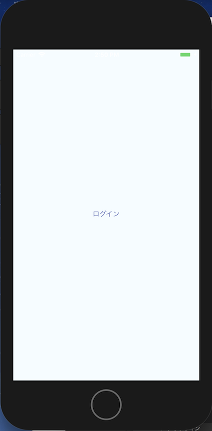
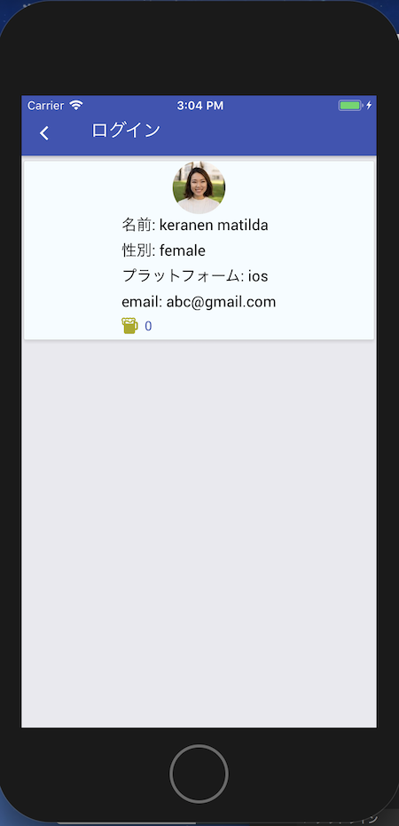

# redux-form

form送信をする場合はredux-formライブラリが便利なので、  
redux-formライブラリを導入します。  

```
$ yarn add redux-form
```

reducer.jsにてredux-formのreducerを追加します。  

```reducer.js
import { combineReducers } from 'redux'
import { reducer as formReducer } from 'redux-form'
import user from './user'

const allReducers = combineReducers({
  form: formReducer,
  user,
})

export default allReducers
```

EntryScreen画面にてメールアドレスの入力画面を作成します。  

```EntryScreen.js
/**
 * Sample React Native App
 * https://github.com/facebook/react-native
 * @flow
 */

import React from 'react'
import { connect } from 'react-redux'
import { View, StyleSheet } from 'react-native'
import { Container, Item, Header, Body, Title, Content, Right, Footer, FooterTab, Card, Input, Button, Text } from 'native-base'
import { Field, reduxForm } from 'redux-form'
import { update } from '../modules/user'

const red = '#FF0000'

const styles = StyleSheet.create({
  error: {
    color: red,
  },
})

const renderInput = ({ input, placeholder, meta: { touched, error } }) => {
  const hasError = touched && error
  return (
    <View>
      <Item error={!!hasError}>
        <Input placeholder={placeholder} {...input}/>
      </Item>
      {hasError ? <Text style={styles.error}>{error}</Text> : <Text />}
    </View>
  )
}

// メールアドレス判定
function isEmail(mail) {
  const mail_regex1 = new RegExp('(?:[-!#-\'*+/-9=?A-Z^-~]+\.?(?:\.[-!#-\'*+/-9=?A-Z^-~]+)*|"(?:[!#-\[\]-~]|\\\\[\x09 -~])*")@[-!#-\'*+/-9=?A-Z^-~]+(?:\.[-!#-\'*+/-9=?A-Z^-~]+)*') // eslint-disable-line
  const mail_regex2 = new RegExp('^[^\@]+\@[^\@]+$')
  if (mail.match(mail_regex1) && mail.match(mail_regex2)) {
    // 全角チェック
    if (mail.match(/[^a-zA-Z0-9\!\"\#\$\%\&\'\(\)\=\~\|\-\^\\\@\[\;\:\]\,\.\/\\\<\>\?\_\`\{\+\*\} ]/)) {
      return false
    }
        // 末尾TLDチェック（〜.co,jpなどの末尾ミスチェック用）
    if (!mail.match(/\.[a-z]+$/)) {
      return false
    }
    return true
  }
  return false
}

@reduxForm({
  form: 'login',
  validate: values => {
    const errors = {}
    if (!values.email) {
      errors.email = '必須項目です'
    } else if (!isEmail(values.email)) {
      errors.email = 'メールアドレスではありません'
    }
    return errors
  },
})
@connect(
() => ({}),
{update})
export default class EntryScreen extends React.Component {

  submit = (values) => {
    const { navigation } = this.props
    this.props.update(values.email).then(() => navigation.navigate('Login'))
  }

  render () {
    const {handleSubmit} = this.props

    return (
      <Container>
        <Header>
          <Body>
            <Title>ログイン</Title>
          </Body>
          <Right />
        </Header>
        <Content>
          <Card>
            <Field name='email' component={renderInput} placeholder='メールアドレス' />
          </Card>
        </Content>
        <Footer>
          <FooterTab>
            <Button full onPress={handleSubmit(this.submit)}><Text>次へ</Text></Button>
          </FooterTab>
        </Footer>
      </Container>
    )
  }
}
```



Fieldコンポーネントで入力チェック項目を指定します。  
name属性のパラメータ名がvalidateチェック時やsubmit時のvaluesのパラメータとして参照できるようになります。  

```
<Field name='email' component={renderInput} placeholder='メールアドレス' />
```

Fieldのパラメータは入力ごとにreduxForm decoratorsで入力チェックされます。  

```
@reduxForm({
  form: 'login',
  validate: values => {
    const errors = {}
    if (!values.email) {
      errors.email = '必須項目です'
    } else if (!isEmail(values.email)) {
      errors.email = 'メールアドレスではありません'
    }
    return errors
  },
})
```

入力チェックコンポーネントです。  
一度でもfocusがあたった場合にtouchedがtrueになります。  
(focusが当たってvalidateエラーがある場合にエラーとする)

```
const renderInput = ({ input, placeholder, meta: { touched, error } }) => {
  const hasError = touched && error
  return (
    <View>
      <Item error={!!hasError}>
        <Input placeholder={placeholder} {...input}/>
      </Item>
      {hasError ? <Text style={styles.error}>{error}</Text> : <Text />}
    </View>
  )
}
```

handleSubmit関数を呼び出すことでsubmit処理の関数を呼び出すことができます。  
values引数にはField項目の入力内容がnameパラメータ名で渡ってきます。  
入力項目をupdate関数で送信し、完了後、User画面に遷移します。  

```
  submit = (values) => {
    const { navigation } = this.props
    this.props.update(values.email).then(() => navigation.navigate('Login'))
  }
  
  render () {
    const {handleSubmit} = this.props

    return (
      <Button full onPress={handleSubmit(this.submit)}><Text>次へ</Text></Button>
    )
  }
```

userのreducerに（user.js）にupdate関数を追加します。  
今回は擬似的にreduxにのみ保存します。  

```user.js
const LOAD = 'user/LOAD'
const UPDATE = 'user/UPDATE'

const initData = {
  user: null,
  email: null,
}

export default function reducer(state = initData, action = {}) {
  switch (action.type) {
    case LOAD:
      return {
        ...state,
        user: action.user || state.user,
      }
    case UPDATE:
      return {
        ...state,
        email: action.email || state.email,
      }
    default:
      return state
  }
}

export function load() {
  return (dispatch, getState, client) => {
    return client
      .get('https://randomuser.me/api/')
      .then(res => res.data)
      .then(user => {
        dispatch({type: LOAD, user: user.results[0]})
        return user
      })
  }
}

export function update(email) {
  return (dispatch) => {
    dispatch({type: UPDATE, email})
    return Promise.resolve(email)
  }
}
```

UserScreen画面ではEntryScreen画面で入力したメールアドレスを表示します。  

```UserScreen.js
/**
 * Sample React Native App
 * https://github.com/facebook/react-native
 * @flow
 */

import React from 'react'
import { connect } from 'react-redux'
import { Platform, StyleSheet, View } from 'react-native'
import { Text, Thumbnail, Icon, Button, Container, Header, Content, Title, Body, Left, Right, Card } from 'native-base'
import { load } from '../modules/user'

const instructions = Platform.select({
  ios: 'ios',
  android: 'android',
})

const bgColor = '#F5FCFF'
const iconColor = '#aaaa00'

const styles = StyleSheet.create({
  container: {
    flex: 1,
    justifyContent: 'center',
    alignItems: 'center',
    backgroundColor: bgColor,
  },
  content: {
    display: 'flex',
    justifyContent: 'center',
    alignItems: 'center',
  },
  beer: {
    marginLeft: -25,
  },
})

const HeaderBackButton = ({onPress}) => (
  <Left>
    <Button transparent>
      <Icon name={Platform.OS === 'ios' ? 'ios-arrow-back' : 'arrow-back'} onPress={onPress} />
    </Button>
  </Left>
)

@connect(
state => ({
  user: state.user.user,
  email: state.user.email,
}),
{load})
export default class UserScreen extends React.Component {
  state = {count: 0}

  componentDidMount () {
    this.props.load()
  }

  render () {
    const { user, email, navigation } = this.props
    const { count } = this.state

    return (
       <Container>
        <Header>
          <HeaderBackButton onPress={() => navigation.goBack()} />
          <Body>
            <Title>ログイン</Title>
          </Body>
          <Right />
        </Header>
        <Content>
          <Card style={styles.container}>
            {user &&
              <View style={styles.content}>
                <Thumbnail source={{uri: user.picture.large}} />
                <View>
                  <Text>名前: {user.name.last} {user.name.first}</Text>
                  <Text>性別: {user.gender}</Text>
                  <Text>プラットフォーム: {instructions}</Text>
                  <Text>email: {email}</Text>
                  <Button small iconRight  transparent primary onPress={() => this.setState({count: count + 1})}>
                    <Icon type='Ionicons' name='md-beer' style={{color: iconColor}}/>
                    <Text style={styles.beer}>{count}</Text>
                  </Button>
                </View>
              </View>
            }
          </Card>
        </Content>
      </Container>
    )
  }
}
```


