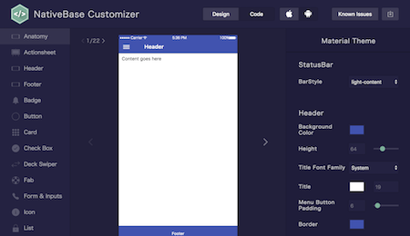
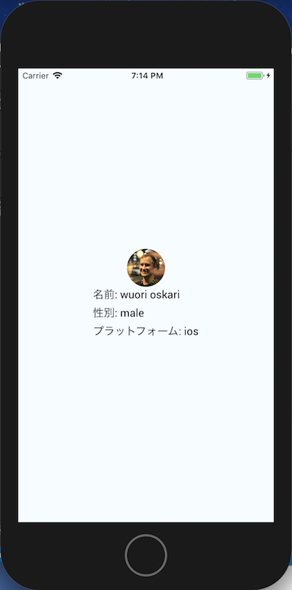

# NativeBase

[NativeBase](http://docs.nativebase.io/)を使うと  
iOS、Android両対応なネイティブのUIコンポーネントを使うことができます。  

```
$yarn add native-base
```

# アプリのthemeの作成
テーマを変更するには[Customize](http://docs.nativebase.io/Customize.html)を参考にします。  

## ejectTheme.jsから生成する
次のコマンドでテーマを生成することができます。  

```
$ node node_modules/native-base/ejectTheme.js
$ react-native link
```

native-base-themeフォルダ以下にテーマのファイルが作成されます。  

* components: 各UIコンポーネント独自のスタイリングが記述されています。  
* variables: アプリ内の共通色、アプリ内の共通フォント（テーマ）を記述します。  

カスタムテーマを適用するにはindex.jsに以下のように初期化する必要があります。  
デフォルトのテーマでplatform.js/material.js/commonColor.jsがそれぞれ用意されています。  
以下の例はmaterialテーマを適応した場合の初期化です。  

```index.js
import { StyleProvider } from 'native-base'
import getTheme from './native-base-theme/components'
import material from './native-base-theme/variables/material'

const Application = () => (
  <StyleProvider style={getTheme(material)}>
    <Provider store={store}>
      <App/>
    </Provider>
  </StyleProvider>
)

AppRegistry.registerComponent('learnReactNative', () => Application)
```

### Theme Color
テーマ色を変更するにはplatform.js(もしくはmaterial.js/commonColor.js)以下の色を変更します。  

- Primary color: brandPrimary
- Info color: brandInfo
- Success color: brandSuccess
- Danger color: brandDanger
- Warning color: brandWarning


### Theme Font
デフォルトのフォントファミリーを変更するには、platform.js(もしくはmaterial.js/commonColor.js)のfontFamily変数を変更します。
以下のフォントファミリがデフォルトで利用可能です。  

- Entypo
- EvilIcons
- FontAwesome
- Foundation
- Ionicons
- MaterialIcons
- Octicons
- Roboto
- Roboto_medium
- SimpleLineIcons
- Zocial


テーマの細かい色指定やサイズ指定は次のチートシートを参考にしてください。  
[Theme variables Cheat sheet](http://docs.nativebase.io/docs/ThemeVariables.html)  


## NativeBase Customizerより生成
次のビジュアルエディタより独自のvariable.jsを生成できます。  
[NativeBase Customizer](https://nativebase.io/customizer/)  



# アイコン
アイコンは[Icon](http://docs.nativebase.io/Components.html#header-transparent-headref)コンポーネントを利用することで利用可能です。  
内部的には[react-native-vector-icons](https://github.com/oblador/react-native-vector-icons)のvectorアイコンを利用しています。  
[アイコン一覧](https://oblador.github.io/react-native-vector-icons/)より利用可能なアイコンを検索して  
種別を指定して利用します。  

```
<Icon type='Ionicons' name='md-beer' style={{color: iconColor}}/>
```

# NativeBaseのUIコンポーネントを利用する
App.jsにてText、Thumbnail、Button、Iconコンポーネントを利用します。  

```App.js
/**
 * Sample React Native App
 * https://github.com/facebook/react-native
 * @flow
 */

import React from 'react'
import { connect } from 'react-redux'
import { Platform, StyleSheet, View } from 'react-native'
import { Text, Thumbnail, Icon, Button } from 'native-base'
import { load } from './modules/user'

const instructions = Platform.select({
  ios: 'ios',
  android: 'android',
})

const bgColor = '#F5FCFF'
const iconColor = '#aaaa00'

const styles = StyleSheet.create({
  container: {
    flex: 1,
    justifyContent: 'center',
    alignItems: 'center',
    backgroundColor: bgColor,
  },
  content: {
    display: 'flex',
    justifyContent: 'center',
    alignItems: 'center',
  },
  beer: {
    marginLeft: -25,
  },
})

@connect(
state => ({
  user: state.user.user,
}),
{load})
export default class App extends React.Component {
  state = {count: 0}

  componentDidMount () {
    this.props.load()
  }

  render () {
    const { user } = this.props
    const { count } = this.state

    return (
      <View style={styles.container}>
        {user &&
          <View style={styles.content}>
            <Thumbnail source={{uri: user.picture.large}} />
            <View>
              <Text>名前: {user.name.last} {user.name.first}</Text>
              <Text>性別: {user.gender}</Text>
              <Text>プラットフォーム: {instructions}</Text>
              <Button small iconRight  transparent primary onPress={() => this.setState({count: count + 1})}>
                <Icon type='Ionicons' name='md-beer' style={{color: iconColor}}/>
                <Text style={styles.beer}>{count}</Text>
              </Button>
            </View>
          </View>
        }
      </View>
    )
  }
}
```

