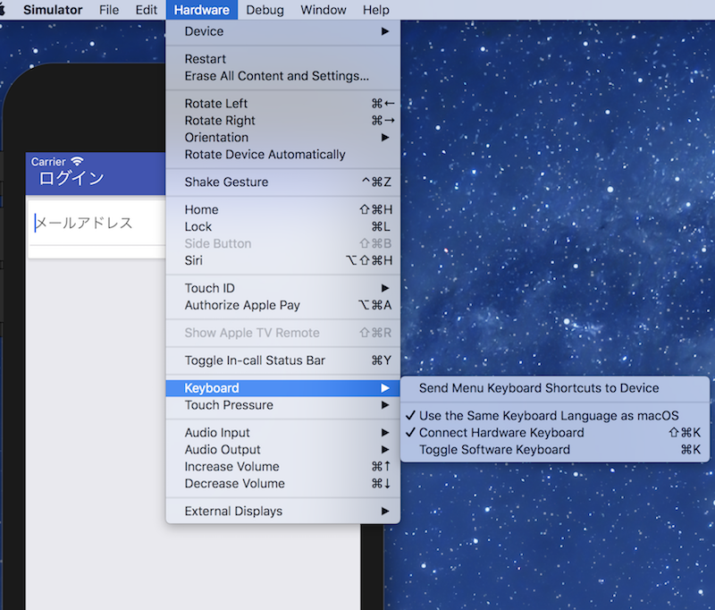

# jest
[Jest](https://jestjs.io/docs/ja/tutorial-react-native)はJavaScriptのテストフレームワークです。  
特にReact DOMツリーのテストもできるフレームワークです。(React以外のJavaScriptフレームワークでも使える)  
jest用のeslintプラグインとjestテスト用のredux-mock-storeが必要なため、
次のパッケージを追加します。  

```
$ yarn add --dev eslint-plugin-jest redux-mock-store
```

jestコマンドが使えるようにjestをglobalインストールします。 

```
$ yarn global add jest
```

jestテスト用にnative-baseは自動変換されないようにpackage.jsonを変更します。  

```
  "jest": {
    "preset": "react-native",
    "transformIgnorePatterns": [
      "/node_modules/(?!native-base)/"
    ]
  }
```

testフォルダを作成します。  
.eslintrc.jsをコピーしてjestテスト用の.eslintrc.jsを作成し、testフォルダ以下に置きます。  
extendsに`'plugin:jest/recommended'`、pluginsに`'jest'`を追加します。  

```
  'extends': ['eslint:recommended', 'plugin:react/recommended', 'plugin:react-native/all', 'plugin:jest/recommended'],
  'plugins': [
    'react',
    'react-native',
    'jest',
  ],
```

test.jsを作成します。  
[UIのスナップショットテスト](https://jestjs.io/docs/ja/snapshot-testing)を行います。  

```test.js
import React from 'react'
import EntryScreen from '../src/screens/EntryScreen'
import renderer from 'react-test-renderer'
import configureStore from 'redux-mock-store'
import { Provider } from 'react-redux'


const mockStore = configureStore([])

describe('EntryScreen', () => {

  // redux-mock-storeの初期化
  const initialState = {
    user: {
      email: null,
    },
  }
  const store = mockStore(initialState)

  it('renders correctly', () => {
    const tree = renderer
      .create(
        <Provider store={store}>
          <EntryScreen />
        </Provider>
      )
      .toJSON()
    expect(tree).toMatchSnapshot()
  })

})
```

`yarn test`でテストを実行すると、test/__snapshots__フォルダが作成されます。  

```
$ yarn test
yarn run v1.7.0
$ jest
 PASS  test/test.js
  EntryScreen
    ✓ renders correctly (66ms)

Test Suites: 1 passed, 1 total
Tests:       1 passed, 1 total
Snapshots:   1 passed, 1 total
Time:        1.77s, estimated 2s
Ran all test suites.
✨  Done in 2.42s.
```

EntryScreen.jsのrenderの一部を次のように変更します。  

```
<FooterTab>
  <Button full onPress={handleSubmit(this.submit)}><Text>前へ</Text></Button>
  <Button full onPress={handleSubmit(this.submit)}><Text>次へ</Text></Button>
</FooterTab>
```

再びtestを行うとスナップショットからの変更が検知されてエラーとなります。  

```
$ yarn test
yarn run v1.7.0
$ jest
 FAIL  test/test.js
  EntryScreen
    ✕ renders correctly (81ms)

  ● EntryScreen › renders correctly

    expect(value).toMatchSnapshot()

    Received value does not match stored snapshot "EntryScreen renders correctly 1".

    - Snapshot
    + Received

    @@ -297,10 +297,67 @@
                    "paddingRight": 16,
                  }
                }
                uppercase={false}
              >
    +           前へ
    +         </Text>
    +       </View>
    +       <View
    +         accessible={true}
    +         isTVSelectable={true}
    +         onResponderGrant={[Function]}
    +         onResponderMove={[Function]}
    +         onResponderRelease={[Function]}
    +         onResponderTerminate={[Function]}
    +         onResponderTerminationRequest={[Function]}
    +         onStartShouldSetResponder={[Function]}
    +         style={
    +           Object {
    +             "alignItems": "center",
    +             "alignSelf": "stretch",
    +             "backgroundColor": "transparent",
    +             "borderBottomWidth": null,
    +             "borderColor": null,
    +             "borderLeftWidth": null,
    +             "borderRadius": 0,
    +             "borderRightWidth": null,
    +             "borderTopWidth": null,
    +             "elevation": 0,
    +             "flex": 1,
    +             "flexDirection": null,
    +             "height": 55,
    +             "justifyContent": "center",
    +             "opacity": 1,
    +             "paddingBottom": 6,
    +             "paddingTop": 6,
    +             "shadowColor": null,
    +             "shadowOffset": null,
    +             "shadowOpacity": null,
    +             "shadowRadius": null,
    +           }
    +         }
    +       >
    +         <Text
    +           accessible={true}
    +           allowFontScaling={true}
    +           ellipsizeMode="tail"
    +           style={
    +             Object {
    +               "backgroundColor": "transparent",
    +               "color": "#6b6b6b",
    +               "fontFamily": "System",
    +               "fontSize": 14,
    +               "lineHeight": 16,
    +               "marginLeft": 0,
    +               "marginRight": 0,
    +               "paddingLeft": 16,
    +               "paddingRight": 16,
    +             }
    +           }
    +           uppercase={false}
    +         >
                次へ
              </Text>
            </View>
          </View>
        </View>

      21 |       )
      22 |       .toJSON()
    > 23 |     expect(tree).toMatchSnapshot()
         |                  ^
      24 |   })
      25 | 
      26 | })

      at Object.<anonymous> (test/test.js:23:18)

 › 1 snapshot failed.
Snapshot Summary
 › 1 snapshot failed from 1 test suite. Inspect your code changes or run `yarn test -u` to update them.

Test Suites: 1 failed, 1 total
Tests:       1 failed, 1 total
Snapshots:   1 failed, 1 total
Time:        3.885s
Ran all test suites.
```

問題がない場合は、次のjestコマンドでスナップショットを更新します。  

```
$ jest --updateSnapshot
```

# detox
[detox](https://github.com/wix/detox)はReact NativeのE2Eテストツールです。  
Automation Test（自動UIテスト）を行うことができます。  
まず、必要なパッケージをインストールします。  

```
$ yarn add --dev detox eslint-plugin-detox
$ yarn global add detox-cli
```

Homebrewでapplesimutilsをインストールします。  

```
$ brew tap wix/brew
$ brew install applesimutils
```

package.jsonに次の設定を追加します。  
learnReactNativeの名前の箇所（.app、.xcodeproj、-schemeの引数）は各プロジェクト名に置き換えてください  

```package.json
"detox": {
    "configurations": {
      "ios.sim.debug": {
        "binaryPath": "ios/build/Build/Products/Debug-iphonesimulator/learnReactNative.app",
        "build": "xcodebuild -project ios/learnReactNative.xcodeproj -scheme learnReactNative -configuration Debug -sdk iphonesimulator -derivedDataPath ios/build",
        "type": "ios.simulator",
        "name": "iPhone 8"
      }
    },
    "test-runner": "jest"
  }
```

プロジェクトフォルダ直下で以下のコマンドを実行します。  

```
$ detox build
$ detox init -r jest
```

e2eフォルダが生成され、フォルダ以下にconfig.json、init.js、firstTest.spec.jsが生成されます。  
jestフォルダ以下の.eslintrc.jsをe2eフォルダにコピーします。  
e2eフォルダの.eslintrc.jsにはeslint-detox-pluginの設定を追記します。  

```
'plugins': [
  'react',
  'react-native',
  'jest',
  'detox',
],
```

firstTest.spec.jsにE2Eテストを追加します。  

```
/* eslint-env detox/detox */
describe('Example', () => {
  beforeEach(async () => {
    await device.reloadReactNative()
  })

  it('ログイン画面からメールアドレスを入力してログインできる', async () => {
    await expect(element(by.text('ログイン'))).toBeVisible()
    await element(by.id('email')).typeText('abc@example.com')
    await element(by.id('login')).tap()
    await expect(element(by.text('ユーザ'))).toBeVisible()
  })
})
```

EntryScreen.jsに操作するUIにはtestID属性を付与します。  

```EntryScreen.js
// custom属性追加
const renderInput = ({ input, placeholder, meta: { touched, error }, ...custom}) => {
  const hasError = touched && error
  return (
    <View>
      <Item error={!!hasError}>
        <Input placeholder={placeholder} {...input} {...custom}/>
      </Item>
      {hasError ? <Text style={styles.error}>{error}</Text> : <Text />}
    </View>
  )
}

export default class EntryScreen extends React.Component {
  render () {
    const {handleSubmit} = this.props

    return (
      <Container>
        <Header>
          <Body>
            <Title>ログイン</Title>
          </Body>
          <Right />
        </Header>
        <Content>
          <Card>
            <Field testID='email' name='email' component={renderInput} placeholder='メールアドレス' />
          </Card>
        </Content>
        <Footer>
          <FooterTab>
            <Button testID='login' full onPress={handleSubmit(this.submit)}><Text>次へ</Text></Button>
          </FooterTab>
        </Footer>
      </Container>
    )
  }
}
```

次のコマンドでtestを実行できます。  

```
$ detox test
```

うまく動作しない場合は、simulatorのソフトウェアキーボードが動作しているか確認してみてください。  
（Toggle Software Keyboardで表示切り替えを試してみる）  
  

## Android Emulatorで実行する場合
Android StudioでのAndroidプロジェクト側での設定が必要になります。  
詳細は下記を参照ください。  
[Adding Android](https://github.com/wix/detox/blob/master/docs/Introduction.Android.md)
