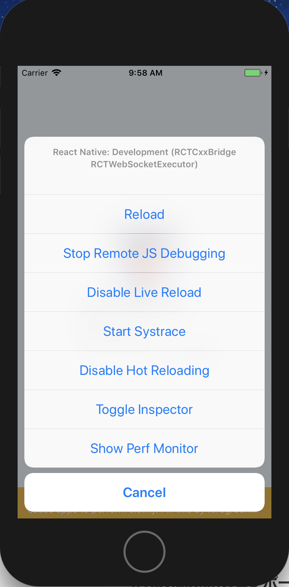
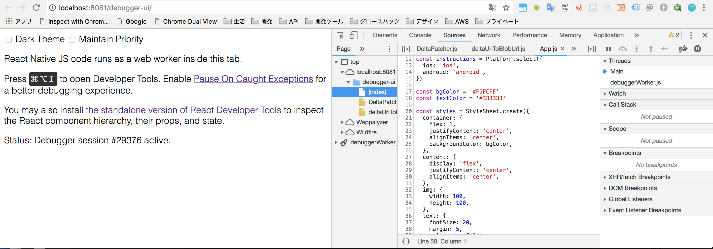
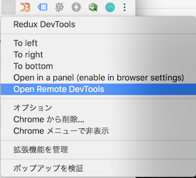
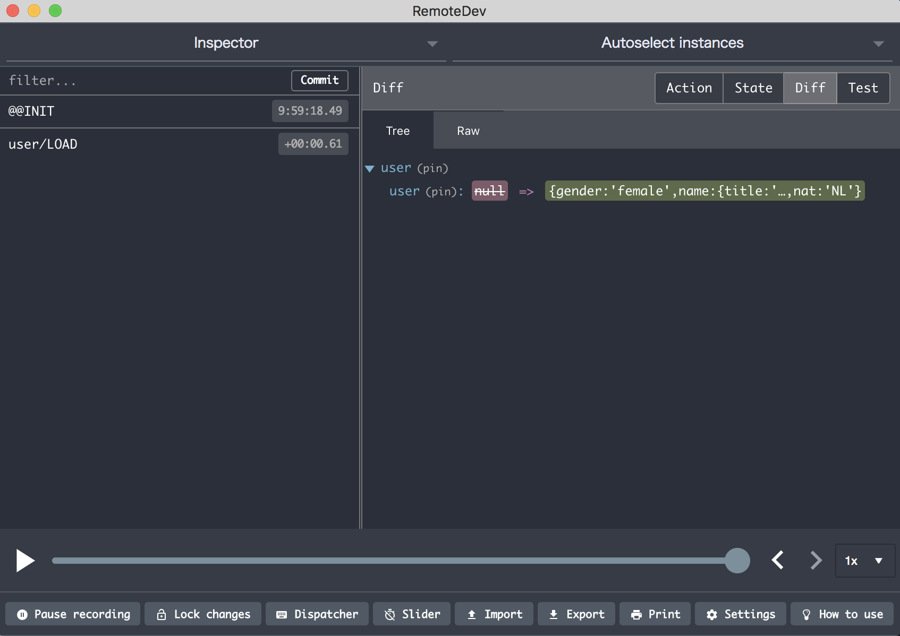

# Redux
以下のnpmパッケージを追加する  

```
$ yarn add redux react-redux redux-thunk axios 
$ yarn add --dev remote-redux-devtools@0.5.0 babel-plugin-transform-decorators-legacy
```

.babelrcにtransform-decorators-legacyプラグインとbabel-plugin-module-resolverの設定を追加します。   
transform-decorators-legacyはdecoratorsを使うための設定です。

```.babelrc
{
  "presets": ["react-native"],
  "plugins": ["transform-decorators-legacy"]
}
```

index.jsにReduxの初期化を行います。  

```index.js
import { AppRegistry } from 'react-native'
import React from 'react'
import { createStore, applyMiddleware, compose } from 'redux'
import { Provider } from 'react-redux'
import { composeWithDevTools } from 'remote-redux-devtools'
import thunk from 'redux-thunk'
import client from 'axios'
import allReducers from './src/modules/reducer'
import App from './src/App'

// TODO: 開発時以外は環境設定で有効にしない
const isDevelopment = true
const reduxCompose = isDevelopment ? composeWithDevTools : compose
// axiosをthunkの追加引数に加える
const thunkWithClient = thunk.withExtraArgument(client)
// redux-thunkをミドルウェアに適用
const store = createStore(allReducers, reduxCompose(applyMiddleware(thunkWithClient)))


// リクエスト共通処理
client.interceptors.request.use(req => {
  // 共通のAPI処理、認証ヘッダー等を付与する
  return req
}, err => Promise.reject(err))

// レスポンス共通処理
client.interceptors.response.use(res => res, err => {
  // 通信キャンセル
  if (client.isCancel(err)) {
    return Promise.reject({code: 999, message: 'cancel'})
  }

  if (err.response.status === 401) {
    // 認証エラーなど
  }
  return Promise.reject(err.response || {})
})


const Application = () => (
  <Provider store={store}>
    <App/>
  </Provider>
)

AppRegistry.registerComponent('learnReactNative', () => Application)
```

user.jsにreducerを作成します。(axiosでのAPIコール)  

```src/modules/user.js
const LOAD = 'user/LOAD'

const initData = {
  user: null,
}

export default function reducer(state = initData, action = {}) {
  switch (action.type) {
    case LOAD:
      return {
        ...state,
        user: action.user || state.user,
      }
    default:
      return state
  }
}

export function load() {
  return (dispatch, getState, client) => {
    // axiosでのAPIコール
    return client
      .get('https://randomuser.me/api/')
      .then(res => res.data)
      .then(user => {
        dispatch({type: LOAD, user: user.results[0]})
        return user
      })
  }
}
```

App.jsではconnectによってreducerのstateを取得します。  
取得したuser情報でrenderメソッドにて描画します。  

```App.js
/**
 * Sample React Native App
 * https://github.com/facebook/react-native
 * @flow
 */

import React from 'react'
import { connect } from 'react-redux'
import { Platform, StyleSheet, Image, Text, View } from 'react-native'
import { load } from './modules/user'

const instructions = Platform.select({
  ios: 'ios',
  android: 'android',
})

const bgColor = '#F5FCFF'
const textColor = '#333333'

const styles = StyleSheet.create({
  container: {
    flex: 1,
    justifyContent: 'center',
    alignItems: 'center',
    backgroundColor: bgColor,
  },
  content: {
    display: 'flex',
    justifyContent: 'center',
    alignItems: 'center',
  },
  img: {
    width: 100,
    height: 100,
  },
  text: {
    fontSize: 20,
    margin: 5,
    color: textColor,
  },
})

@connect(
state => ({
  user: state.user.user,
}),
{load})
export default class App extends React.Component {

  componentDidMount () {
    this.props.load()
  }

  render () {
    const { user } = this.props
    console.log(user)
    return (
      <View style={styles.container}>
        {user &&
          <View style={styles.content}>
            <Image source={{uri: user.picture.large}} style={styles.img} />
            <View>
              <Text style={styles.text}>名前: {user.name.last} {user.name.first}</Text>
              <Text style={styles.text}>性別: {user.gender}</Text>
              <Text style={styles.text}>プラットフォーム: {instructions}</Text>
            </View>
          </View>
        }
      </View>
    )
  }
}
```

# デバッグ

エミュレータ上でCommand + Dキーを押すと各種デバッグ機能が使えます。



* Reload: 画面を再読み込みします
* Start Remote JS Debugging: Chromeの開発者ツールでデバッグできるようになります
* Enable Live Reload: ファイル変更保存時に自動的に画面を再読込します。
* Start Systrace: 端末のメモリなどのハードウェア状態を確認できます。
* Enable Hot Reloading: Live Reloadとセットで使います。内部パラメータは変更しないで画面表示のみ再レンダリングします。
* Toggle Inspector: Viewのレイアウト情報をデバッグできます。
* Show Perf Monitor: どのレンダリングに負荷がかかっているかなどの

Start Remote JS Debuggingを有効にするとChromeで以下の画面が開きます。  
開発者ツールを開くとリモートでソースコードが見れるようになります。
ブレークポイントなどをセットしてデバッグします。  



Remote Redux Devtoolを導入している前提で

[Chromeアドオン](https://chrome.google.com/webstore/detail/redux-devtools/lmhkpmbekcpmknklioeibfkpmmfibljd)を入れておくと
エミュレータのReduxのパラメータ状態を確認することができます。  
開発者ツール画面を開いている状態でアドオンのアイコンからOpen Remote Devtoolsを開きます。  




