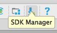
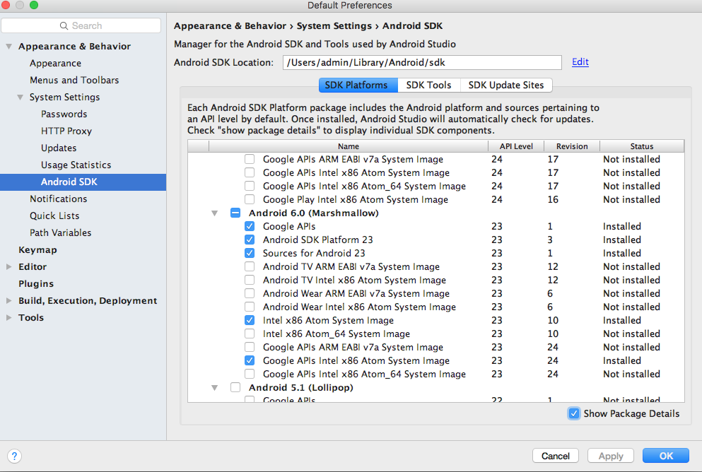
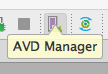
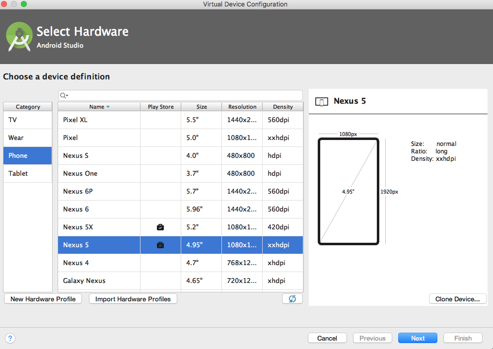
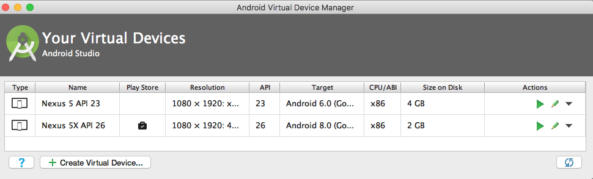
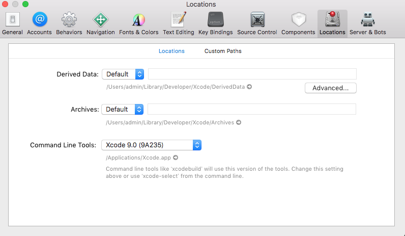

# 環境構築

[React Nativeインストールガイド](https://facebook.github.io/react-native/docs/getting-started.html)

NodeJSはインストール済み前提(v8.10.0)  
以下を追加でインストール  

```
$brew install watchman
$npm install -g react-native-cli
```

## Android

Java 8のインストール  
[JDK 8](http://www.oracle.com/technetwork/java/javase/downloads/jdk8-downloads-2133151.html)をインストールする

Android Studioのインストール  
[Googleのダウンロードページ](https://developer.android.com/studio/index.html)より取得

Android SDKをインストールする  
Android SDK パッケージマネージャを起動




Show Package Detailにチェックをつけて下記をインストール

* Google APIs
* Android SDK Platform 23
* Sources for Android 23
* Intel x86 Atom System Image
* Google APIs Intel x86 Atom System Image

Android NDKをインストールする  

1. [File] > [Project Structure] > [SDK Location]
2. NDKがインストールされていない場合、Android NDK locationにダウンロード用のリンクが表示されているのでそこからダウンロード開始

.bash_profileに以下のAndroid SDK、Android NDK、JDKのパスを記述

```.bash_profile
ANDROID_HOME=/Users/admin/Library/Android/sdk
ANDROID_NDK_HOME=/Users/admin/Library/Android/sdk/ndk-bundle
export JAVA_HOME=`/usr/libexec/java_home -v 1.8`
export PATH=/usr/local:$PATH:$NODEBREW_HOME/bin:$ANDROID_HOME:$ANDROID_NDK_HOME:$ANDROID_HOME/tools:$ANDROID_HOME/platform-tools
```

Android エミュレーターの作成をする  
AVD Managerを起動する  



API 23のNexus 5を作成する  

  
  
  

local.propertiesファイルを作成  
(gradleコマンドからANDROID_HOMEパスを認識させるために必要)

```
echo sdk.dir=/Users/(ユーザ名)/Library/Android/sdk > android/local.properties
```

下記コマンドでエミュレータ上で実行される

```
# エミュレータを起動
# うまく起動しない場合はAndroid StudioのAVDマネージャより起動する
$ ./Users/(ユーザ名)/Library/Android/sdk/emulator -avd Nexus_5_API_23
$ react-native run-android
```

## iOS

IDE:Xcode  
Apple Developerの[ダウンロードページ](https://developer.apple.com/download/more/)より取得

コマンドラインツールをXCodeのPreferenceよりダウンロードしておく  


下記コマンドでエミュレータ上で実行される

```
$ react-native run-ios
```

# VSCodeの設定
VSCodeに[Flow](https://flow.org/)を認識させる。  
[flow-for-vscode](https://github.com/flowtype/flow-for-vscode)プラグインを導入する。  
.vscode/settings.jsonを作成して以下を記述  

```settings.json
{
  "flow.useNPMPackagedFlow": true,
  "javascript.validate.enable": false,
}
```

# ライブラリ

* UI：[native-base](https://docs.nativebase.io/)、[アイコン](https://github.com/oblador/react-native-vector-icons)
* 画面遷移：[react-navigation](https://reactnavigation.org/docs/intro/)、[redux + react-navigation](https://qiita.com/kazuyuka76/items/6295e5ee282e5ba494a1)
* Test: [Jest](http://jestjs.io/docs/ja/tutorial-react-native.html)
